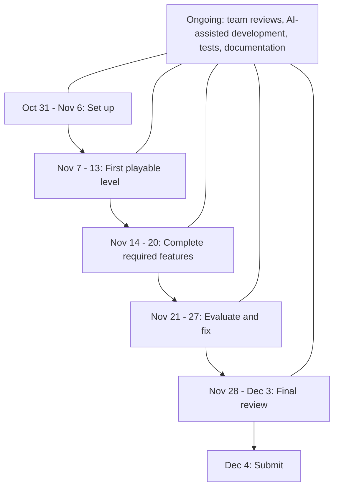

```mermaid
flowchart TD
    A["Oct 31 - Nov 6: Set up"]
    B["Nov 7 - 13: First playable level"]
    C["Nov 14 - 20: Complete required features"]
    D["Nov 21 - 27: Evaluate and fix"]
    E["Nov 28 - Dec 3: Final review"]
    F["Dec 4: Submit"]

    A --> B --> C --> D --> E --> F

    K["Ongoing: team reviews, AI-assisted development, tests, documentation"]

    K --- A
    K --- B
    K --- C
    K --- D
    K --- E
```