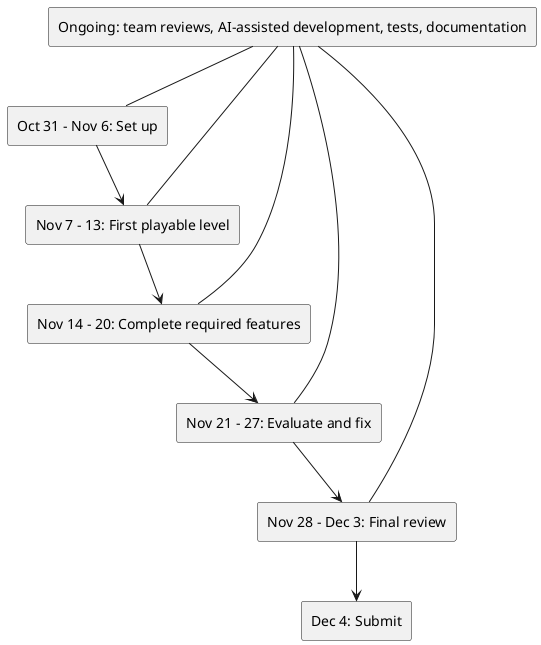

```plantuml
@startuml
top to bottom direction
rectangle "Oct 31 - Nov 6: Set up" as A
rectangle "Nov 7 - 13: First playable level" as B
rectangle "Nov 14 - 20: Complete required features" as C
rectangle "Nov 21 - 27: Evaluate and fix" as D
rectangle "Nov 28 - Dec 3: Final review" as E
rectangle "Dec 4: Submit" as F
rectangle "Ongoing: team reviews, AI-assisted development, tests, documentation" as K
A --> B
B --> C
C --> D
D --> E
E --> F
K -- A
K -- B
K -- C
K -- D
K -- E
@enduml
```